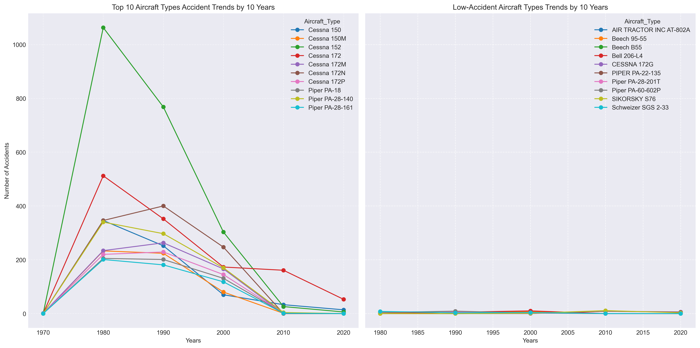
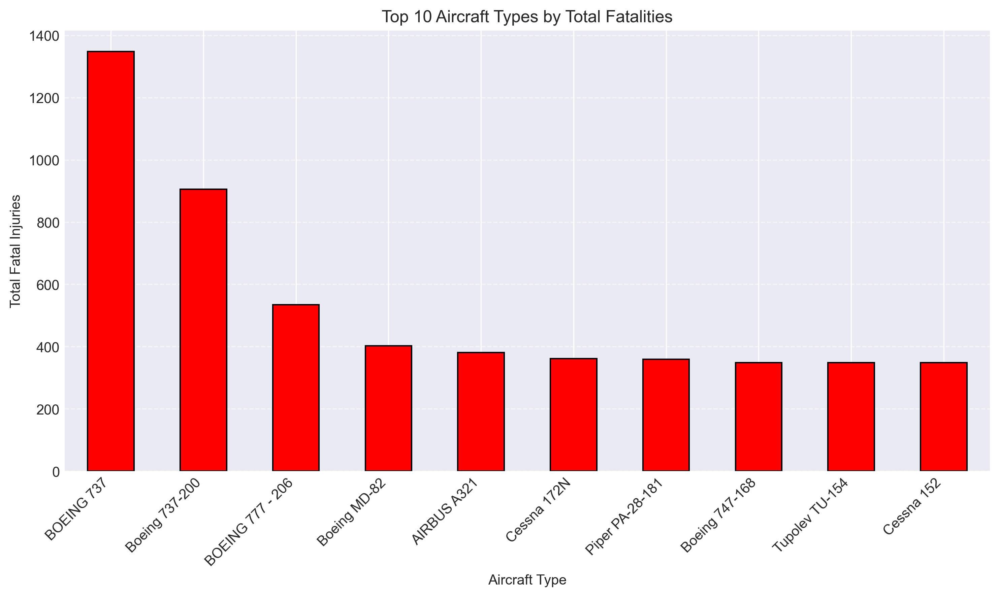
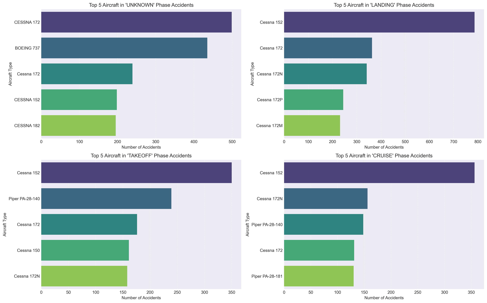

# Aircraft Analysis from Aviation Accident Data.

## Overview
Our company preparing to enter the aviation industry hence, it is essential to make informed decisions that prioritize safety and reduce risk. This project leverages Aviation Accident dataset  to guide strategic aircraft purchasing decisions.

The objective is to identify aircraft types with the lowest risk for the company to start this new business endeavor, through careful data exploration, cleaning, analysis, and visualizations.

## Business Understanding
As part of its diversification strategy, our company is expanding into new industries specifically, the operation of aircraft for both commercial and private enterprises. To ensure a strong  entry into the aviation sector, the company must make data-driven decisions when selecting which aircraft to purchase.

By analyzing aviation accident records, I aim to uncover patterns related to accident frequency, flight phases, and fatality rates. These findings will be provide actionable insights that the Head of the new Aviation Division will use to decide the aicraft to purchase.

#### Key Business Questions
 - Which aircraft types historically had the highest and lowest number of accidents?
 - During which phases of flight are accidents most likely to occur?
 - Which aircraft types are associated with the highest number of fatalities?
 - How does the purpose of flight impact accident rates?
 - What data-supported recommendations can be made to minimize risk when selecting aircraft?

 ## Data Understanding and analysis
 The data for this analysis is the [**Aviation Accident Database & Synopses, up to 2023**](https://www.kaggle.com/datasets/khsamaha/aviation-accident-database-synopses), accessed from **Kaggle**. This dataset is based on records from the U.S. National Transportation Safety Board (NTSB) and contains detailed information on aviation accidents.

#### Description of Data
 - Time Period: The dataset covers accidents reported from 1962 to 2023, providing a broad historical view of aviation safety trends.
 - Number of Records: Thousands of entries, each representing a unique accident.
 - Key Columns Used:
    - `Aircraft Make and Model`: To identify aircraft types.
    - `Phase of Flight`: To assess when accidents are most likely to occur.
    - `Purpose of Flight`: To understand how intended use affects risk.
    - `Total Fatal Injuries`: To evaluate the severity of accidents.
    - `Weather Condition`: To examine the role of environmental factors in accidents.
    - `Event Date`: To track accident timelines and trends over the years.

#### Key Visualizations
   1. Accident Trends by Aircraft Type (Line Graph) - 
This line graph illustrates how frequently different aircraft types have been involved in accidents over time.

   2. Fatalities by Aircraft Type (Bar Chart) - 
This bar chart shows the total number of fatalities.

   3. Accidents by Phase of Flight (Bar Chart) - 
This bar chart displays the distribution of accidents across various flight phases.

